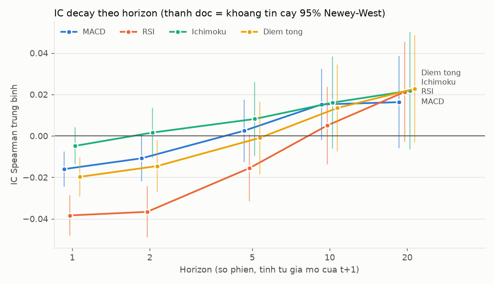
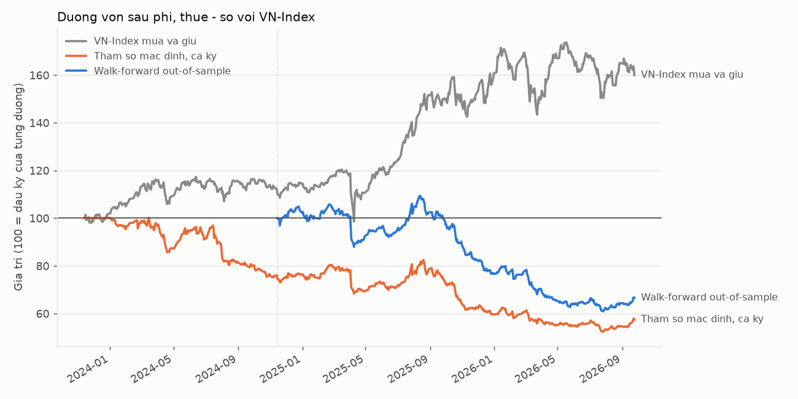

# bot-phan-tich


## Overview

A Telegram bot and research stack for Vietnamese equities (HOSE/HNX/UPCOM).
Daily OHLCV for ~1,500 symbols lives in one parquet store; `analysis/scoring.py`
combines MACD, adaptive-threshold RSI and Ichimoku (with a below-cloud veto)
into a score in [−100, 100]. `analysis/score_history.py` computes that score
for every bar in one pass, matching the bar-by-bar reference exactly and
running ~125–150× faster ([benchmark](docs/benchmark.md)).

**Backtest methodology.** Signals at the close of t fill at the open of t+1;
shares settle T+2 (counted in trading sessions); exits that gap through the
stop or target fill at the open; sells on limit-down-locked sessions
(per-exchange price bands) are deferred; 0.25% round-trip fees plus 0.1% sales
tax. The universe is selected point-in-time. Parameters are chosen by
walk-forward (12-month train, 3-month test, 12 combinations by Sharpe), and
the stitched out-of-sample curve is evaluated with the Probabilistic and
Deflated Sharpe Ratios (Bailey & López de Prado, 2014).

**Result: no edge on this sample.** All figures are after costs, Nov 2023 – Sep 2026, from
[`outputs/backtest/report.md`](outputs/backtest/report.md):

| | Return | CAGR | Sharpe | Max DD | PSR | DSR |
|---|---:|---:|---:|---:|---:|---:|
| Walk-forward out-of-sample (Nov 2024 →) | −33.4% | −19.9% | −1.39 | −44.3% | 0.023 | 0.002 |
| VN-Index buy & hold, same window | +44.1% | +22.1% | 1.09 | −18.1% | 0.923 | – |
| Default parameters, full period | −42.6% | −17.8% | −1.21 | −47.7% | 0.016 | 0.001 |
| VN-Index buy & hold, full period | +60.0% | +18.1% | 1.01 | −18.1% | 0.949 | – |

All 12 parameter combinations lose money. Cross-sectional rank IC of the total
score is +0.023 at 20 days (Newey–West t = 1.72, not significant) and −0.020
at 1 day (t = −4.1, short-term reversal). Fixing T+2, gap fills and limit-down
handling moved the same signals from −33.7% to −42.6%. Details: section 5b
below; interview notes (in Vietnamese): [INTERVIEW_NOTES.md](INTERVIEW_NOTES.md).

---

## About the bot

A Telegram bot for technical analysis of Vietnamese stocks. It combines three
indicator systems, **MACD, RSI (adaptive thresholds) and Ichimoku Kinko Hyo**,
across the **whole market** (HOSE/HNX/UPCOM), not just a handful of sample
tickers. The bot's commands and replies are in Vietnamese.

Core architecture: prices for the whole market live in a single parquet store
(`data/market_store.py`). Each symbol's recommendation is precomputed into a
"snapshot" (`analysis/snapshot.py`) after the morning session and after the
close, so `/loc` (screener) and `/tinhieu` (signals) only read a ready-made
table and answer in under a second. Heavy work runs in a separate thread
(`asyncio.to_thread`), so the bot keeps answering other commands while it loads
data. See [docs/kien-truc.md](docs/kien-truc.md) (Vietnamese).

---

## 0. Quick start

### 0.1. Install

```bash
pip install -r requirements.txt
cp .env.example .env    # Windows: copy .env.example .env, then fill in TELEGRAM_BOT_TOKEN
```

Details (virtualenv, optional DNSE key): sections 1 and 2.

### 0.2. The two data-loading commands

| Command | What it does | How long |
|---|---|---|
| `python scripts/backfill_data.py` | Downloads prices for the whole market (HOSE/HNX/UPCOM, about 1,500 symbols) and stores them in **a single file**, `data/market/ohlcv.parquet`. | First run 2–3 minutes (500 sessions per symbol). Later runs about 1–2 minutes: it still requests every symbol once, but only fetches the last 10 sessions and merges them into the existing store. |
| `python scripts/build_snapshot.py` | Runs the strategy (MACD + adaptive RSI + Ichimoku) for every sufficiently liquid symbol in the store and writes the results table `data/market/snapshot.parquet`. **This is the table that `/loc` and `/tinhieu` read**; those two commands compute nothing themselves. | 5–20 seconds (about 200 symbols, depending on the machine). |

**Required order: `backfill_data.py` first, then `build_snapshot.py`.**
`build_snapshot.py` only reads the store that `backfill_data.py` creates. In
the wrong order (or without a backfill) the store is empty, the snapshot is
empty, and `/loc` replies "đang chuẩn bị dữ liệu" (preparing data). That was
exactly the earlier bug.

While the bot is running, it repeats these two steps itself Monday–Friday at
**11:35** (after the morning session; results are marked provisional) and
**15:05** (after the close; the official version). If it starts on a machine
with no data, it also loads in the background (check progress with
`/trangthai`). Running the two commands by hand is mainly for having data
right away, before a demo.

**Common problems**

| Symptom | Cause | Fix |
|---|---|---|
| `/loc`, `/tinhieu` reply "đang chuẩn bị dữ liệu" (preparing data) | No snapshot yet: the two commands were not run, were run in the wrong order, or the bot is loading in the background | Run `backfill_data.py`, then `build_snapshot.py`. If the bot is loading by itself, type `/trangthai` to see progress and wait a few minutes |
| `backfill_data.py` reports many failed symbols (last line `Xong: X/Y ma`, X much lower than Y) | Vietcap is temporarily rate-limiting or blocking the IP; the price-board endpoint is unofficial | Wait a few minutes and rerun. A few dozen failures are normal (suspended or newly listed symbols) |
| `build_snapshot.py` reports an empty liquid universe | The store is empty (no backfill, or every download failed), or each symbol has fewer than 250 sessions and so fails `universe.min_listed_days` (because `MARKET_COUNT_BACK` < 250) | Run `backfill_data.py` first and check that the `Xong:` line covers enough symbols. If you set `MARKET_COUNT_BACK`, use ≥ 400 and run `backfill_data.py --full` |
| The machine hangs or is very slow while building | Older versions spawned several processes, each holding a copy of the price store. The current version runs sequentially with a peak of about 250 MB of RAM | Check `snapshot.max_workers: 1` in `config/settings.yaml`. On a weak machine, set `UNIVERSE_MAX_SYMBOLS=200` in `.env` to compute only the 200 most liquid symbols |
| No data for today | The official snapshot only exists **after 15:05**; the provisional morning version after 11:35 | Before 11:35 the data is from **the previous session**; `/loc` and `/tinhieu` state "Dữ liệu phiên dd/mm" (data as of session dd/mm), so say so when demoing. Between 11:35 and 15:05 it is the provisional version (labelled). `/market` always shows the latest VN-Index level, including intraday |

### 0.3. Run the bot

```bash
python scripts/run_bot.py
```

Suspend the Render service before running locally (see section 7.1).

---

## 1. Installation

Requires Python 3.10+.

```bash
git clone https://github.com/thienanpham160806-code/bot-phan-tich.git
cd bot-phan-tich

python -m venv .venv
# Windows
.venv\Scripts\activate
# macOS / Linux
source .venv/bin/activate

pip install -r requirements.txt
cp .env.example .env   # Windows: copy .env.example .env
```

---

## 2. Configuring `.env`

Open `.env` and fill in:

| Variable | Where to get it |
|---|---|
| `TELEGRAM_BOT_TOKEN` | Chat with [@BotFather](https://t.me/BotFather) on Telegram, command `/newbot` |
| `DNSE_API_KEY`, `DNSE_API_SECRET` | EntradeX → LightSpeed API (see below). **Optional** |
| `VNSTOCK_ACCEPT_TOS` | Set to `1` after running vnstock's `register_user()` once |

> **Never** commit `.env`. It is already in `.gitignore` (only `.env.example`,
> an empty template, is committed).

Without `DNSE_API_KEY`/`DNSE_API_SECRET` the bot still works: `data/router.py`
automatically falls back to the backup source (Vietcap/VCI via `vnstock`, no
API key needed), so all end-of-day data features keep running. See the data
source table in section 6.

### Getting a DNSE API key (to use the primary source)

1. Open an online brokerage account at <https://www.dnse.com.vn> (eKYC with a
   chip-based national ID card). No deposit is needed for market data.
2. Log in to **EntradeX** (<https://banggia.dnse.com.vn> or the EntradeX app)
   → **LightSpeed API** in account settings → create a key.
3. **The API secret is shown only once.** Copy it into `.env` right away; if
   you lose it you must create a new key. If you can't find LightSpeed API,
   contact DNSE (hotline 024 7108 9234 / hello@dnse.com.vn) with your 064C
   account number and full name.
4. `pip install openapi-sdk` (as in DNSE's docs) **does not work**: that
   package name is only an example in the docs, not the real PyPI name. The
   real PyPI package is `dnse-sdk-openapi` (already in `requirements.txt`, no
   separate install needed; see `data/dnse.py`).

Vietcap configuration (backup source, **no API key needed**): through the
`vnstock` library. Run `register_user()` once and set `VNSTOCK_ACCEPT_TOS=1`
in `.env`. **vnstock is an optional dependency**: since 25/09/2026 the package
has been quarantined on PyPI, so it is no longer in `requirements.txt`.
Install it separately when it is available: `pip install ".[vnstock]"` (or
`pip install "vnstock>=4.0"`). Without vnstock the bot still runs: prices come
from the local store, Vietcap's public endpoint and DNSE; commands that need
financial statements, industry data or disclosures reply "no data yet"
instead of failing (`tests/test_optional_vnstock.py`).

> If you accidentally commit `DNSE_API_KEY`/`DNSE_API_SECRET` to Git: go to
> EntradeX and **create a new key immediately** (treat the old one as leaked),
> then clean the commit history. Rotate the key first, clean git second.

---

## 3. Loading data and running the bot

The two data-loading commands, their order and common problems: see
**section 0.2**. Options for `backfill_data.py`: `--full` (reload from
scratch), `--watchlist-only` (only the 12 symbols in `config/universe.yaml`,
for fast development). Sessions fetched on the first load:
`market_store.count_back_bootstrap` in `config/settings.yaml` or the
`MARKET_COUNT_BACK` variable.

Optional extras (not needed for the bot to run):

```bash
# Fundamentals (P/E, P/B, ROE) for the liquid universe; enables the pe=/roe=
# filters in /loc. Cached for 7 days; skipped if rerun too soon.
python scripts/backfill_fundamentals.py

# Full backtest (walk-forward, PSR/DSR, cost sensitivity) plus the latest
# 3/6-month windows, vs VN-Index buy & hold -> outputs/backtest/ (section 5b), ~5 min.
python scripts/run_backtest.py

# Signal-generation speed: old O(n^2) version vs vectorized -> docs/benchmark.md.
python scripts/bench_signals.py

# IC analysis of the MACD/RSI/Ichimoku/total scores (section 5b) -> outputs/ic/.
python scripts/ic_analysis.py
```

Tests: `pytest -q`. Code quality: `ruff check src tests scripts`.

On Windows you can use the task script (`.\tasks.ps1 <task>`; see
`tasks.ps1` for the full list).

---

## 4. Bot commands

Commands fall into three groups. Recommendation labels are the bot's
Vietnamese output: MUA (buy), TÍCH LUỸ (accumulate), THEO DÕI (watch),
GIẢM TỶ TRỌNG (reduce), BÁN (sell).

### 🎯 Group 1: Analyse a single stock
| Command | Aliases | What it does |
|---|---|---|
| `/kn SYMBOL` | `/khuyennghi`, `/rec` | Recommendation (MUA/TÍCH LUỸ/THEO DÕI/GIẢM TỶ TRỌNG/BÁN), price plan (entry zone, stop loss, target), R:R, suggested position size |
| `/chart SYMBOL` | `/bieudo` | Candlestick chart with the Ichimoku cloud, MACD and RSI |
| `/info SYMBOL` | `/tracuu` | Listing profile, P/E, P/B, ROE, market cap and recent corporate disclosures |
| `/fin SYMBOL` | `/bctc` | Multi-year review of the financial statements: growth, profitability, capital structure, cash flow (banks also get net interest income, provisions, loans/deposits). With a financial-statement PDF it also extracts the auditor's opinion and risks from the notes: send the file with the caption `/fin SYMBOL`, or reply to the file with `/fin SYMBOL`. Scanned PDFs without a text layer cannot be read |

### 🔍 Group 2: Find opportunities and market-wide information
| Command | Aliases | What it does |
|---|---|---|
| `/loc [conditions]` | `/screen` | Market-wide stock screener: 3 built-in screens (breakout, accumulation, warning), or custom conditions (e.g. `/loc san=HOSE kn=MUA kl=1.2`) |
| `/tinhieu` | `/signals` | Symbols with a MUA/TÍCH LUỸ or BÁN/GIẢM TỶ TRỌNG recommendation in the latest session (states which session's data) |
| `/market` | | VN-Index: latest level (intraday it is the live level, fetched directly from Vietcap), change, range, volume |
| `/tintuc` | `/news` | Latest macro news, legal documents, decrees and resolutions. Hourly automatic news is **on by default** for anyone who messages the bot; `/tintuc off` to turn it off, `/tintuc on` to turn it back on |

### ⭐ Group 3: Watchlist and personal alerts
| Command | Aliases | What it does |
|---|---|---|
| `/sub SYMBOL` | `/theodoi` | Add a symbol to your personal watchlist |
| `/watchlist` | `/danhsach` | Show the watchlist with current recommendations |
| `/unsub SYMBOL` | `/bosach` | Remove a symbol from the watchlist |
| `/canhbao` | `/alerts` | Turn automatic end-of-day alerts on/off (15:05 each trading day) |
| `/trangthai` | `/status` | Data status: price store, snapshot (fresh/stale/provisional), background loading progress, latest error, RAM in use |
| `/help` | `/start` | Detailed help menu and quick-action keyboard |

`/loc` supports these custom filter keys: `san` (exchange), `kn` (minimum
recommendation), `rsi` (RSI zone), `may` (position relative to the Kumo
cloud), `macd` (cross direction), `phanky` (divergence), `diem` (minimum
score), `kl` (minimum volume ratio), `pe`/`roe` (only after running
`backfill_fundamentals.py`). Formulas for the three built-in screens:
[docs/cong-thuc.md](docs/cong-thuc.md) (Vietnamese).

---

## 5. Architecture

Full diagram and design principles: [docs/kien-truc.md](docs/kien-truc.md)
(Vietnamese). Formulas and thresholds for each indicator:
[docs/cong-thuc.md](docs/cong-thuc.md) (Vietnamese).

```
Vietcap/DNSE --> data/market_store.py (WHOLE-MARKET price store, 1 parquet file)
                        |  scripts/backfill_data.py (download/update)
                        v
              analysis/snapshot.py (build_snapshot: recommend() once per symbol,
                        |            sequential, writes snapshot.parquet)
                        |  scripts/build_snapshot.py, or automatically via
                        |  bot/scheduler.py: 11:35 (provisional) and 15:05
                        v
              analysis/screener.py, /tinhieu  --  READ-ONLY on snapshot.parquet
                        |
                        v
                   bot/ (aiogram, polling)
```

The most important confluence rule: **Ichimoku can veto a buy
recommendation** when the price is below the Kumo cloud, however high the
combined MACD/RSI score is (see `analysis/scoring.py`).

Heavy functions (lookups, recommendations, charts, financial-statement text
mining, watchlist scans) run through `await asyncio.to_thread(...)` in the
handlers, so `/help` still answers immediately while another heavy command is
running (see `tests/test_nonblocking.py`).

---

## 5b. Quantitative validation

### Information Coefficient (IC) analysis

`python scripts/ic_analysis.py` (module `backtest/ic.py`). For each session t,
across the **cross-section** of symbols in the liquid universe *at that time*
(selected with data up to the end of the previous month), it computes the
Spearman rank correlation between each indicator's score (using data up to t
only) and the return from the **open of t+1** to the open of t+1+h. IC
measures whether the score **ranks correctly** which stocks will outperform
which. Full results: `outputs/ic/` (`ic_summary.csv`, `ic_daily.csv`,
`ic_monthly.csv`, `ic_decay.png`).

Sample: 02/01/2024 – 22/09/2026, 675 sessions, median 280 symbols per session.

| Indicator | h | Mean IC | Std dev | ICIR | t-stat | Newey–West t-stat | Months with IC > 0 |
|---|---:|---:|---:|---:|---:|---:|---:|
| MACD | 5 | 0.0025 | 0.117 | 0.02 | 0.55 | 0.32 | 58% |
| MACD | 10 | 0.0152 | 0.111 | 0.14 | 3.54 | 1.72 | 61% |
| MACD | 20 | 0.0163 | 0.104 | 0.16 | 4.00 | 1.44 | 66% |
| RSI | 5 | −0.0155 | 0.130 | −0.12 | −3.09 | −1.88 | 33% |
| RSI | 10 | 0.0050 | 0.124 | 0.04 | 1.04 | 0.52 | 61% |
| RSI | 20 | 0.0212 | 0.119 | 0.18 | 4.56 | 1.72 | 69% |
| Ichimoku | 5 | 0.0082 | 0.131 | 0.06 | 1.62 | 0.91 | 64% |
| Ichimoku | 10 | 0.0160 | 0.124 | 0.13 | 3.34 | 1.42 | 64% |
| Ichimoku | 20 | 0.0218 | 0.117 | 0.19 | 4.79 | 1.50 | 66% |
| Total score | 5 | −0.0010 | 0.133 | −0.01 | −0.19 | −0.11 | 58% |
| Total score | 10 | 0.0135 | 0.125 | 0.11 | 2.78 | 1.25 | 61% |
| Total score | 20 | 0.0227 | 0.113 | 0.20 | 5.15 | 1.72 | 72% |



The chart labels are in Vietnamese: "Diem tong" = total score, "Horizon (so
phien...)" = horizon in sessions, "thanh doc" = vertical bars (95% Newey–West
confidence intervals).

**Interpretation: the result is essentially zero, and it should be said
plainly.**

- **IC is very small.** Every |IC| ≤ 0.023. No indicator, the total score
  included, is statistically significant at 5% after correction: the highest
  Newey–West t-stat is 1.72 (< 1.96).
- **The plain t-stat is inflated.** At h = 10–20, the returns of two adjacent
  sessions share 9–19 sessions, so the IC series is strongly autocorrelated.
  The plain t-stats (3.5–5.2, which look "highly significant") are 2–3× the
  Newey–West t-stats (lag = h). Reporting only the plain t-stat would be
  fooling yourself.
- **Short-term reversal is the clearest signal, and it works against the
  strategy.** At h = 1 session, IC is **significantly negative**: RSI −0.038
  (Newey–West t −7.7, IC > 0 in only 6% of months), total score −0.020
  (t −4.1). Stocks that score high today tend to fall back over the next 1–2
  sessions; IC only turns positive from h ≈ 10 sessions, and stays weak. A
  strategy that buys at the next open after a high score, with a 1.5 ATR stop,
  walks straight into that pullback. That is a plausible explanation for the
  weak backtest below.
- **Limitations:** only ~2.7 years of data (the store keeps ~750 sessions per
  symbol), dividend-adjusted prices, and each symbol's exchange taken from the
  current listing. IC measures the ability to *rank* stocks against each
  other; the actual strategy *times* entries with stops and targets, so the
  two measures complement rather than replace each other.

### Full backtest vs VN-Index

`python scripts/run_backtest.py` → `outputs/backtest/` (source tables:
[`report.md`](outputs/backtest/report.md), generated automatically, never
edited by hand). Whole store: 1,511 symbols, tested from 14/11/2023 (after a
60-session indicator warm-up) to 24/09/2026. Universe selected point-in-time
(~290 symbols per slice). Round-trip fees 0.25% + 0.1% sales tax, starting
capital VND 100 million. Walk-forward: 12-month train / 3-month test, grid of
12 combinations. Every figure below is after fees and taxes.

| Strategy | Period | Return | CAGR | Sharpe | Sortino | Max drawdown | Turnover/yr | Trades | PSR | DSR |
|---|---|---:|---:|---:|---:|---:|---:|---:|---:|---:|
| **Walk-forward out-of-sample** | 11/2024–09/2026 | −33.4% | −19.9% | −1.39 | −1.66 | −44.3% | 30.1 | 1,435 | 0.023 | 0.002 |
| VN-Index buy & hold | 11/2024–09/2026 | +44.1% | +22.1% | 1.09 | 1.50 | −18.1% | – | – | 0.923 | – |
| Default parameters, full period | 11/2023–09/2026 | −42.6% | −17.8% | −1.21 | −1.45 | −47.7% | 25.6 | 2,121 | 0.016 | 0.001 |
| Best in-sample (of 12 combinations) | 11/2023–09/2026 | −31.0% | −12.3% | −0.78 | −0.94 | −38.9% | 27.7 | 2,348 | 0.088 | 0.013 |
| VN-Index buy & hold | 11/2023–09/2026 | +60.0% | +18.1% | 1.01 | 1.37 | −18.1% | – | – | 0.949 | – |

Cost sensitivity (round-trip fee; the 0.1% sales tax is unchanged):

| Round-trip fee | Default, full period: CAGR / Sharpe | Walk-forward OOS: CAGR / Sharpe |
|---|---|---|
| 0.15% | −14.9% / −0.98 | −18.2% / −1.25 |
| 0.25% | −17.8% / −1.21 | −19.9% / −1.39 |
| 0.35% | −19.4% / −1.34 | −18.0% / −1.24 |



The chart labels are in Vietnamese: "VN-Index mua va giu" = VN-Index buy &
hold, "Tham so mac dinh, ca ky" = default parameters, full period.

**Interpretation:**

- **The strategy trails VN-Index by a wide margin and loses money in absolute
  terms.** All **12 of 12 parameter combinations** lose over the full period
  (CAGR from −12% to −27%,
  [`grid_full_period.csv`](outputs/backtest/grid_full_period.csv)). This is
  not one unlucky parameter set; the whole strategy family has no edge on
  this sample, consistent with the IC ≈ 0 result above.
- **PSR/DSR confirm it.** The probability that the walk-forward's true Sharpe
  is > 0 is only 0.023; after removing the selection bias of 12 trials (DSR)
  it drops to 0.002. Even the best in-sample combination (Sharpe −0.78) has a
  DSR of only 0.013.
- **Costs are not the main cause, but they are not small either.** Turnover is
  25–30× capital per year (median holding period 4 sessions). Cutting fees
  from 0.35% to 0.15% improves CAGR by only about 4.5 percentage points; it
  still loses heavily. The average trade loses −0.31% *before* costs and
  −0.66% after. In the walk-forward column, the 0.35% fee beats 0.25% because
  each fee level re-selects parameters on the train windows (ending up with
  different combinations), not because higher fees help.
- **Fixing the methodology made the results worse.** Replaying the same
  signals through the engine at each commit
  ([`engine_ablation.csv`](outputs/backtest/engine_ablation.csv),
  `scripts/engine_ablation.py`): original engine −33.7% (717 of 2,323 trades
  sold on the next business day, violating T+2) → with T+2 −23.2% → with
  gap fills at the open −35.9% → with limit-down locks −42.6%. T+2 *improved*
  the result (positions were forced to sit through the short-term reversal,
  matching the negative IC at h = 1–2), while gaps and the price floor made it
  substantially worse. The old −33.7% was unjustifiably optimistic.
- The latest 3- and 6-month windows (required by the original course brief;
  `outputs/backtest_3m.csv`, `backtest_6m.csv`) are too short to conclude
  anything: +2.2% vs VN-Index −5.1% (3 months), −2.0% vs −0.2% (6 months).

**Known limitations:** ~2.9 years of data (one market cycle); VN-Index is a
price index (no dividends) and buy & hold pays no fees; each symbol's exchange
comes from the current listing; symbols delisted before the store was built
are missing from it; the limit-down rule is conservative (the whole session
counts as unsellable even if the order could have filled before the price
reached the floor).

---

## 6. Data sources

| Data | Primary source | Backup source | API key needed? |
|---|---|---|---|
| Historical/end-of-day prices (OHLCV) | Whole-market store loaded from Vietcap (`data/vietcap.py`, public price-board endpoint); symbols outside the store: DNSE OpenAPI (`data/dnse.py`) | Vietcap/VCI via `vnstock` | DNSE: yes; Vietcap: no |
| Whole-market symbol list | DNSE (`/market/instruments`) | Vietcap (`/price/symbols/getAll`) | No (Vietcap) |
| Financial statements, fundamentals | Vietcap/VCI via `vnstock` | – | No |
| Industry map | Vietcap/VCI via `vnstock` | – | No |
| Corporate disclosures | Vietcap/VCI via `vnstock` | – | No |
| Realtime (live trades) | **Not implemented**: `data/realtime.py` only has an interface and a stub, off by default (`realtime.enabled: false`) | – | – |

`data/router.py` is the ONLY place that knows the source priority; the rest
of the system just calls `get_router().ohlcv(...)` and does not care where the
data comes from. When a source errors, times out or hits its quota, the router
switches to the next source in the order declared in
`config/settings.yaml: data.price_sources` / `data.fundamental_sources`.

### Data troubleshooting

| Situation | What the system does / what you should do |
|---|---|
| DNSE errors / cannot connect / no API key | `data/router.py` switches to Vietcap. If it cannot connect at all (e.g. Render in Singapore blocked by DNSE), DNSE is skipped for 15 minutes rather than retried |
| Rate-limited (429, or vnstock/vnai calling `sys.exit()` when the quota is hit) | Exponential backoff, up to 5 attempts; if it still fails, wait a few minutes and rerun. The vnstock Guest tier allows about 20 requests per minute |
| `backfill_data.py`/`backfill_fundamentals.py` reports many failed symbols, or empty results without an exception | Vietcap's public endpoint is **unofficial** and may temporarily rate-limit or block by IP or unusual request patterns. Retry after a few minutes; from a server/cloud abroad you are more likely to be blocked than from a personal machine in Vietnam (see section 7) |
| All sources fail | Returns stale cached data (if any, with a warning in the log); with no cache, reports an error to the user. The bot does not crash |
| Dirty data (BOM, CRLF, duplicates) | `data/cleaner.py` normalises it before caching |
| Unknown symbol / not enough history | Handlers catch specific errors and reply with a readable message via `bot/formatters.py:error_card()` |
| The bot just started on a machine with no data (first run, or Render Free just restarted) | The bot builds **provisional** data for the watchlist (`config/universe.yaml`, ~12 symbols) within seconds, so `/loc` and `/tinhieu` answer immediately with a "Dữ liệu tạm thời" (provisional data) note, then loads the whole market in the background (a few minutes) |
| `/loc`, `/tinhieu` report loading or an error | The message states the progress (e.g. "450/1500 mã, khoảng 2 phút nữa", i.e. 450/1,500 symbols, about 2 minutes left) or the error from the latest load. Type `/trangthai` for details |

---

## 7. Operations and deployment

The bot uses **long polling** (`dispatcher.start_polling()`): no open port,
webhook or SSL domain is needed.

### 7.1. Running on a personal machine (testing / development)

The production instance runs on Render (section 7.3). To run it locally:

```bash
python scripts/run_bot.py
```

No need to set `PYTHONPATH` or run `pip install -e .`; the script adds `src/`
to the path itself. Logs appear in the window and are written to
**`logs/bot.log`**; closing the window (or `Ctrl+C`) stops the bot.

> ⚠️ **Suspend the Render service before running locally.** Two processes
> sharing one `TELEGRAM_BOT_TOKEN` fight over incoming messages and Telegram
> reports a conflict (`Conflict: terminated by other getUpdates`).

**How to check the bot is alive:** type `/trangthai` in Telegram (if it
answers, the bot is running).

### 7.2. Running on a Linux VPS with Docker

The repo ships a `Dockerfile` and `docker-compose.yml`:

```bash
# 1. Clone the code onto the Linux VPS (Ubuntu / Debian / CentOS)
git clone https://github.com/thienanpham160806-code/bot-phan-tich.git
cd bot-phan-tich

# 2. Configure environment variables
cp .env.example .env
nano .env  # Fill in TELEGRAM_BOT_TOKEN

# 3. Run in the background with Docker
docker compose up -d --build

# Follow the logs:
docker compose logs -f
```

### 7.3. Deploying on Render.com: real limits and options

**Limits of the Free plan (hit in practice while deploying):**

- **512 MB RAM, shared CPU.** Loading the bot's libraries alone (aiogram,
  pandas, vnstock) takes about 250–300 MB, leaving about 200 MB for data. The
  whole market still fits but close to the limit; going over gets the
  container killed and restarted.
- **No persistent disk.** Everything in `data/` (price store, snapshot,
  watchlists, users' alert settings) is **wiped every time the container
  restarts** (a new deploy, a crash, or a Render-initiated restart). Each time,
  the bot has to reload the price store from scratch: for the first few
  seconds there is only provisional watchlist data; the full universe arrives
  a few minutes later.
- **Sleeps after ~15 minutes without an HTTP request.** The bot only polls
  Telegram outbound and nobody calls it over HTTP, so without a ping service
  the whole process stops (including the 15:05 scan).
- **No Background Worker** (the type that actually fits a polling bot and
  isn't port-scanned). The Free plan reports *"service type is not available
  for this plan"*, so it has to run as a Web Service with a dummy HTTP health
  check in `bot/main.py`.

**Three options:**

| | Option | Data | Cost | Best for |
|---|---|---|---|---|
| **(a)** | **Run on a personal machine** (section 7.1) | Whole market, kept across restarts | Free | **Demos and grading**: fastest and most stable |
| (b) | Paid Render plan + **Persistent Disk** | Whole market, survives restarts | Monthly fee | Long-term 24/7 operation |
| (c) | Render Free + reduced 300-symbol universe + UptimeRobot | Reduced, reloaded on every restart | Free | Keeping the bot online 24/7 without paying, accepting the limits |

**Recommendation: use (a) for demos and grading.** Run
`python scripts/run_bot.py` on a personal machine after running
`scripts/backfill_data.py` and `scripts/build_snapshot.py`; whole-market data
is available immediately and `/loc` answers instantly. (c) is only a fallback
for keeping the bot online; don't use it for a live presentation, since the
container may have just restarted and still be reloading data.

**How to do (b):** upgrade the service to a paid plan → change `render.yaml`
to `type: worker` (no health check / UptimeRobot needed) → add a Persistent
Disk mounted at `/app/data` (the default `DATA_DIR` in the Docker image) →
redeploy. Drop the scale-limiting variables from (c) to run the whole market.

**How to do (c):**

1. Render → **New +** → **Blueprint** → pick this repo, branch `main`.
   `render.yaml` already sets `UNIVERSE_MAX_SYMBOLS=300`,
   `MARKET_COUNT_BACK=400`, `SNAPSHOT_MAX_WORKERS=1`. **If the service was
   created manually** (New + → Web Service, not via Blueprint), `render.yaml`
   is **not applied automatically**: add these three variables yourself in
   the service's **Environment** tab.
2. Fill in `TELEGRAM_BOT_TOKEN` → Deploy.
3. UptimeRobot (free) → **Add New Monitor** → HTTP(s) →
   `https://<service-name>.onrender.com/healthz` → Interval **5 minutes**.
4. Check in Telegram: `/trangthai` (price store, snapshot, loading progress,
   latest error, RAM) and `/trangthai chandoan` (the container's real RAM/CPU,
   whether Vietcap/DNSE are reachable; the Free plan has no Shell, so this is
   the only way to diagnose). On a personal machine, run
   `python scripts/diagnose.py`.

### 7.4. Automatic schedule

Runs on `APScheduler`, Vietnam time (`bot.timezone`):

1. **After the morning session, `bot.midday_cron`, default 11:35 Mon–Fri:**
   fetches today's in-progress candle for the whole store and recomputes the
   snapshot. `/loc` and `/tinhieu` show morning-session prices with a
   provisional note (the candle has not closed; volume covers half a
   session). No alerts are sent. Set `midday_cron: ""` to disable.
2. **End of day, `bot.scan_cron`, default 15:05 Mon–Fri:** reloads the
   closing candle (overwriting the provisional one), computes the official
   snapshot, then compares the state of users' watched symbols (`/sub`) with
   the previous scan. Alerts are sent only on a change: a new recommendation,
   a MACD cross, price moving relative to the Kumo cloud, RSI entering/leaving
   overbought/oversold, volume > 2× the 20-day average, or a price move > 4%
   (at most 3 alerts per symbol per day). Catches up within 1 hour if the bot
   starts late.
3. **News, `bot.news_cron`, default hourly 08:00–22:00:** scans the CafeF and
   VnExpress RSS feeds, classifies items by keyword (Policy & Law / Macro &
   Stock market), and sends items published in the last 2 hours to users who
   have news turned on. The "CafeF Vĩ mô" (macro) feed mixes in social news,
   so only keyword-matching items are kept.

> ⚠️ **Render's Free plan wipes the database on every restart** (`/sub`
> watchlists, `/tintuc off` choices...). The news digest still recovers
> itself: any chat that sends the bot any command is subscribed by default
> (the `AutoSubscribeNews` middleware in `bot/main.py`), so after a restart
> you only need to message the bot once. To receive news even before
> messaging it again, set **`AUTO_SUBSCRIBE_CHAT_IDS`** (comma-separated chat
> ids) in the Environment tab.

---

## 8. Library licences

This project is for educational purposes. Note the terms of some libraries:

- `vnstock`: custom licence, free for personal use; commercial use requires
  the author's permission.
- DNSE LightSpeed API: has restrictions on redistributing data; read the
  terms of service carefully before making the repo public.

---

## 9. Disclaimer

This is an academic project. Signals produced by the bot are **not**
investment advice.
